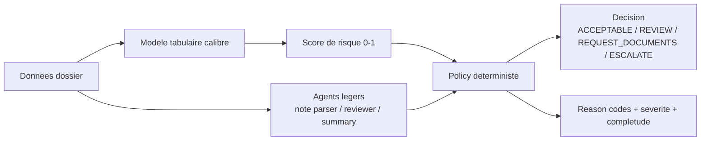
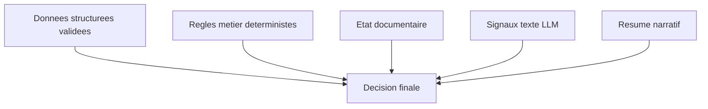
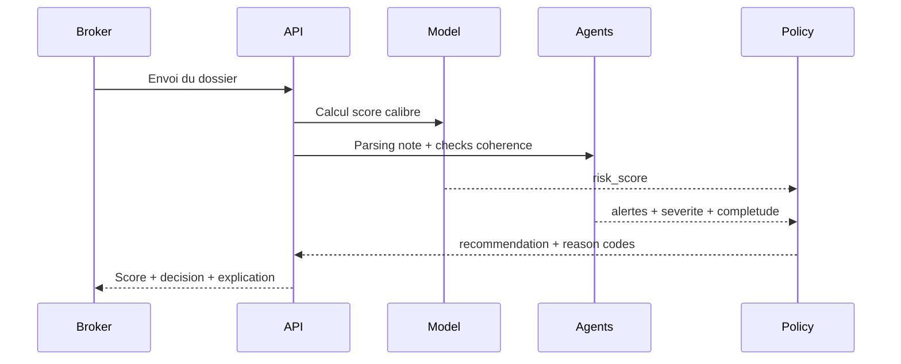

# BrokerFlow AI

BrokerFlow AI est un copilote underwriting.

Le projet ne cherche pas a faire une simple prediction de risque. Il cherche a aider un broker a prendre une decision claire, justifiee et tracable, avec une architecture sobre: modele tabulaire pour la probabilite, policy deterministe pour la decision, agents legers pour le contexte et l'explication.

## Le probleme que nous resolvons

Dans un flux credit reel, deux erreurs coutent cher:
1. accepter un dossier qui va faire defaut,
2. refuser un dossier sain faute de lecture structuree.

Dans beaucoup de workflows, la decision est soit trop intuitive, soit trop opaque. Un score seul ne suffit pas. Un broker a besoin de comprendre pourquoi le dossier est considere risqué, quels signaux sont contradictoires, et quelle action est recommandee.

## Notre approche en une phrase

Nous transformons un score de risque en decision metier explicable, avec des garde-fous qui rendent le systeme robuste meme sans LLM.

## Schema global



## Pourquoi cette architecture 

Le coeur du design est la separation stricte des responsabilites:

1. Le modele ML estime une probabilite de defaut.
2. La policy transforme cette probabilite en decision metier.
3. Les agents ajoutent du contexte (texte, coherence, resume), sans prendre le controle de la decision.

Resultat: systeme explicable, auditable, maintenable, et defendable en entretien.

## Ce que les agents font exactement

Nous gardons volontairement 3 agents seulement pour eviter le sur-engineering.

1. Note parser
Il convertit la note libre en signaux structures.

2. Reviewer
Il verifie la coherence entre donnees structurees, note et documents, et produit des alertes structurees.

3. Summary writer
Il reformule la sortie finale en langage metier lisible pour le broker.

Règle non negociable: les agents n'ont jamais l'autorite finale sur la decision credit.

## Hierarchie de verite en cas de conflit



Lecture:
1. Donnees structurees et regles metier priment.
2. Le texte enrichit, mais ne renverse pas les faits.
3. Le resume explique, mais ne decide jamais.

## Parcours de decision



## Ce que nous avons concretement ameliore

Le systeme est pense pour la decision underwriting, pas pour le benchmark uniquement.

1. Seuil operationnel optimise
Le seuil n'est pas fixe a 0.50 par reflexe. Il est choisi pour mieux detecter les dossiers a risque selon l'objectif metier.

2. Politique de decision explicite
La recommandation ne depend pas uniquement du score. Elle integre aussi completude et severite des alertes.

3. Traçabilite de la decision
Chaque decision est accompagnee de motifs exploitables, pas d'un verdict opaque.

4. Distribution des artefacts propre
Les artefacts legers restent versionnes dans le repo. Les artefacts lourds runtime sont distribues via GitHub Release pour garder un repo leger.

## Philosophie 

Nous faisons volontairement des choix simples:

1. Un modele local leger pour les agents.
2. Un client HTTP unique pour les appels LLM.
3. Des schemas de sortie stricts.
4. Des fallbacks deterministes.
5. Une baseline sans LLM pour comparer la vraie valeur ajoutee.

Si la version assistee par agents n'apporte pas d'amelioration mesurable, la baseline deterministe reste le mode par defaut.

## Fiabilite et garde-fous

Le systeme est concu pour rester utile meme en cas de panne partielle.

1. Timeout et retries limites pour chaque appel LLM.
2. Validation de schema avant usage des sorties agents.
3. Rejet des assertions non supportees.
4. Fallback local deterministe si sortie invalide.
5. Continuite de service si Ollama indisponible.

## Qualite et mesure

Notre niveau d'exigence n'est pas une demo visuelle. C'est la preuve mesuree.

Nous suivons notamment:
1. validite JSON des sorties agents,
2. precision des alertes reviewer,
3. coherence summary versus recommendation,
4. latence p50 et p95,
5. taux de fallback.

Le benchmark inclut des cas propres, contradictoires, incomplets, bruites et ambigus pour eviter les resultats artificiellement optimistes.

## Etat valide de la phase 1 (modeles, donnees, resultats)

Avant de passer a l'etape agents, voici l'etat reel valide par les artefacts de reference:

1. Donnees traitees presentes et exploitables (train/test/history features).
2. Runtime scoring actif avec bundle local et API v2 fonctionnelle.
3. Resultats modeles disponibles avec deux vues complementaires:

- Vue baseline calibree (mesure de reference underwriting):
    - AUC: 0.7277
    - Brier: 0.1498
    - seuil optimal F1: 0.2309
    - source: `raw_baselines_metrics.csv`

- Vue benchmark challengers (comparaison business entre candidats):
    - winner_model: `baseline_logreg`
    - winner_threshold_best_f1: 0.05
    - source: `challenger_winner.json` / `challenger_metrics.csv`

Note de coherence:
- Les seuils 0.2309 et 0.05 proviennent de protocoles d'evaluation differents.
- Il ne s'agit pas d'une contradiction, mais de deux cadres de lecture (baseline calibree vs benchmark challengers).

## Demarrage rapide

### 1) Installer les dependances

```bash
make setup
```

### 2) Lancer API et interface

```bash
python -m src.data.generate_synthetic_cases
make train
make challenge
make run
streamlit run src/ui/app.py
```

## Mode runtime leger via GitHub Release

Le repo reste leger: les binaires modeles lourds ne sont pas commits. Ils sont publies en assets de release.

### Publier les assets

```bash
gh auth status
gh release create v1.0-models \
  --repo BeediGoua/Brokerflow_ai \
  --title "v1.0-models" \
  --notes "Runtime assets for UI/API bootstrap"

make release-upload
```

### Telecharger les assets

```bash
make release-download
```

## Positionnement final

BrokerFlow AI n'est pas un projet qui ajoute des agents pour faire moderne. C'est un projet qui montre une discipline d'architecture:

1. probabilite de risque calculee par un modele tabulaire interpretable,
2. decision encadree par une policy explicite,
3. agents utilises comme assistants bornes,
4. evaluation comparative pour prouver la valeur reelle.

C'est ce qui rend le projet propre techniquement, credible metier, et defensible en entretien d'ingenierie.

## Documentation detaillee

Pour le detail complet de la strategie agents, voir [docs/agents_strategy_ollama_smolagents.md](docs/agents_strategy_ollama_smolagents.md).
