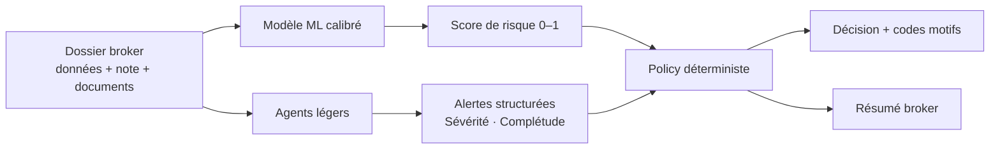
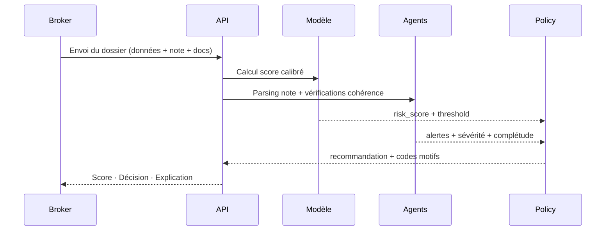

# BrokerFlow AI

> Copilote d'analyse de risque crédit — de la donnée brute à la décision explicable.

**Stack :** Python 3.10 · FastAPI · scikit-learn · Ollama (qwen2.5:3b) · Streamlit · pytest

---

## Le problème

Un broker reçoit des dizaines de dossiers de crédit par semaine. Chaque dossier contient des données structurées (revenus, dette, historique), une note libre rédigée à la main, et des documents parfois manquants ou contradictoires.

Deux erreurs coûtent cher dans ce contexte :
1. **Accepter un dossier qui va faire défaut** — perte financière directe
2. **Refuser un dossier sain** — perte d'opportunité et de relation client

Un score de risque seul ne suffit pas. Le problème n'est pas de produire un chiffre : c'est de transformer un dossier ambigu en **décision claire, justifiée et défendable** — même quand les données sont incomplètes ou contradictoires.

---

## La solution

BrokerFlow AI assemble trois couches complémentaires :

1. **Un modèle ML calibré** qui estime la probabilité de défaut à partir des données structurées
2. **Une policy déterministe** qui traduit ce score en décision métier, en tenant compte de la complétude du dossier et de la sévérité des alertes détectées
3. **Des agents légers** qui lisent la note libre, vérifient la cohérence du dossier, et rédigent une explication lisible pour le broker

Un dossier entre dans l'API. Il en ressort `ACCEPTABLE`, `REVIEW`, `REQUEST_DOCUMENTS` ou `ESCALATE` — avec les codes motifs et un résumé en langage naturel.



---

## Pourquoi des agents — et pourquoi seulement 3

Le risque avec les LLMs dans un contexte crédit, c'est de leur donner trop de pouvoir. Un LLM peut halluciner, être incohérent, ou ignorer un signal critique. Utiliser un LLM comme décideur final n'est pas défendable métier.

Le choix est délibéré : **les agents ne décident pas, ils informent.**

| Agent | Ce qu'il fait | Ce qu'il ne fait pas |
|---|---|---|
| `note_parser` | Extrait les signaux de la note libre du broker (retards de paiement, contradictions, ambiguïtés, négations) — en français et en anglais, avec synonymes | Modifie le score |
| `reviewer` | Vérifie la cohérence entre données structurées, note et documents — produit des alertes typées avec niveau de sévérité | Prend une décision seul |
| `summary_writer` | Reformule la décision finale en langage métier pour le broker | A une autorité sur la recommandation |

Si un agent échoue ou si Ollama est indisponible, **le système bascule automatiquement en mode déterministe** et continue de fonctionner sans interruption. Le fallback n'est pas un plan B — c'est le socle sur lequel les agents s'appuient.

---

## Résultats mesurés

Benchmark sur **50 cas annotés** : profils propres, contradictions emploi/revenus, documents manquants, négations, ambiguïtés volontaires, pièges anti-faux-positifs.

| Métrique | Valeur |
|---|---|
| AUC modèle calibré | **0.728** |
| Brier score | 0.150 |
| Seuil opérationnel (F1 optimal) | **0.231** — pas 0.5 par défaut |
| Précision alertes reviewer | **1.00** |
| Rappel alertes reviewer | **1.00** |
| F1 parser de notes | **0.89** |
| Validité JSON sorties agents | **100 %** |

> Le seuil n'est pas fixé à 0.5 par réflexe. Il est choisi pour maximiser la détection des dossiers à risque selon l'objectif métier réel — quitte à sacrifier un peu de précision globale.

Sources : `models/raw_baselines_metrics.csv` · `models/agent_eval_phase5_results.json`

---

## Parcours d'une décision



---

## Structure du projet

```
src/
  api/         → FastAPI — routes /v1/score, /v1/review, /v2/score
  agents/      → note_parser, reviewer, summary_writer (LLM + fallback déterministe)
  models/      → entraînement, évaluation, scoring runtime
  rules/       → policy déterministe + vérifications de cohérence
  features/    → feature engineering
  eval/        → benchmark agents sur 50 cas annotés
  ui/          → interface Streamlit broker

notebooks/
  03 → EDA risque crédit
  04 → feature engineering
  05 → modèles baseline
  06 → calibration + explicabilité (SHAP)
  07 → évaluation agents
  09 → comparaison champion/challenger
  10 → test live broker (notebook interactif)

tests/         → 44 tests pytest
data/
  agent_eval_cases.json  → 50 cas annotés (standard / hard / adversarial)
```

Documentation technique agents:

- `docs/agents_messages_tools_architecture.md`

---

## Démarrage rapide

**Prérequis :** Python 3.10+, [Ollama](https://ollama.com) installé localement

```bash
# 1. Installer les dépendances
make setup

# 2. Télécharger le modèle LLM local
ollama pull qwen2.5:3b-instruct

# 3. Générer les données synthétiques, entraîner, lancer l'API
python -m src.data.generate_synthetic_cases
make train
make run

# 4. Interface broker (optionnel)
streamlit run src/ui/app.py

# 5. Interface Gradio (optionnel)
make run-gradio

# Windows PowerShell (si make n'est pas installe)
./.venv/Scripts/python.exe -m src.ui.gradio_app
```

Dans Gradio, tu peux charger des cas broker predefinis et executer un batch complet via `Run full broker suite`.

API disponible sur `http://localhost:8000` · Documentation interactive : `http://localhost:8000/docs`

---

## Modèles runtime via GitHub Release

Les artefacts binaires (modèles entraînés) ne sont pas versionnés dans le repo — le dépôt reste léger. Ils sont publiés en assets de release.

```bash
gh release create v1.0-models \
  --repo BeediGoua/Brokerflow_ai \
  --title "v1.0-models" \
  --notes "Runtime assets for UI/API bootstrap"

make release-upload   # publier
make release-download # télécharger
```


