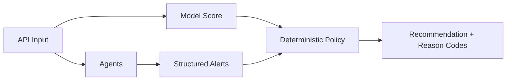
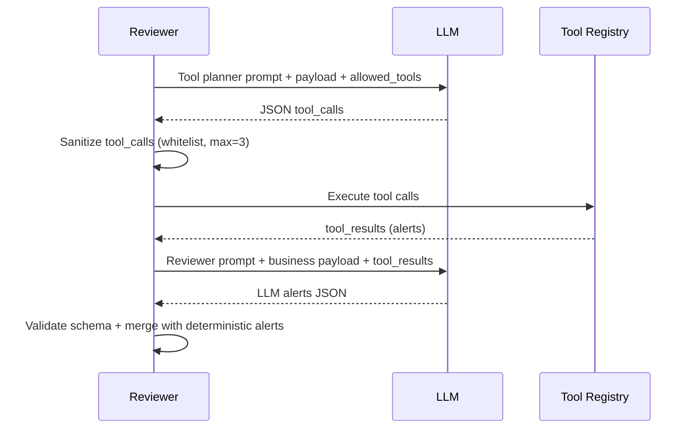

# Architecture Agents: Messages, Tools, Appels et Interactions

Ce document explique comment les agents BrokerFlow AI sont definis et executes:

1. system messages
2. payloads user
3. outils (tools) whitelistes
4. orchestration des appels
5. fallback deterministe

## 1. Vue d'ensemble

BrokerFlow AI utilise une architecture multi-agents bornee:

- `note_parser`: extrait des signaux de la note libre
- `reviewer`: verifie la coherence et produit des alertes structurees
- `summary_writer`: produit un resume metier final

La decision credit finale reste deterministic-policy, jamais confiee au LLM.



## 2. System Message et User Payload

Chaque agent envoie une requete chat avec deux messages:

1. `role=system`: contrat strict (format JSON, contraintes)
2. `role=user`: payload metier serialize en JSON

Exemple conceptuel:

```json
[
  {"role": "system", "content": "Return strict JSON only ..."},
  {"role": "user", "content": "{...business payload...}"}
]
```

Les prompts versionnes sont centralises dans `src/agents/prompts.py`:

- `NOTE_PARSER_PROMPT_V1`
- `REVIEWER_PROMPT_V1`
- `REVIEWER_TOOL_PLANNER_PROMPT_V1`
- `SUMMARY_PROMPT_V1`

## 3. Transport LLM

Le transport HTTP est centralise dans `src/agents/ollama_client.py`:

- endpoint: `/api/chat`
- timeout, retries
- extraction du texte assistant

Ce module ne contient pas de logique metier; il gere uniquement le transport.

## 4. Tools pour le Reviewer

Le reviewer peut utiliser des tools locaux, deterministes et whitelistes.

Definitions des tools: `src/agents/tools_registry.py`

Tools disponibles (V1):

- `check_required_documents`
- `check_employment_note_consistency`
- `check_payment_history_consistency`

Tous les tools:

- sont read-only
- n'accedent pas au reseau
- retournent des alertes structurees (code, severity, message, source, confidence)

## 5. Orchestration des appels (Reviewer)

Lorsque `agent_llm_enabled=true` et `agent_tools_enabled=true`, le reviewer suit ce pipeline:



Si `agent_tools_enabled=false`, le reviewer saute la phase planner/tools et garde la synthese LLM standard.

## 6. Validation et securite

Plusieurs garde-fous sont appliques:

1. parse JSON strict de la sortie planner
2. whitelist des noms de tools
3. maximum 3 tool calls
4. arguments forces en objet JSON
5. validation de schema pour les alertes reviewer
6. deduplication des alertes par code

## 7. Fallback deterministe

Le fallback est actif dans tous les cas d'echec:

- timeout/erreur HTTP
- JSON invalide
- schema invalide
- planner vide ou tool inconnu

Dans ce cas, le systeme continue avec `check_inconsistency_items(...)` et reste operationnel.

## 8. Flags de configuration

Dans `src/config/settings.py`:

- `agent_llm_enabled`: active/desactive l'assistance LLM
- `agent_tools_enabled`: active/desactive planner+tools pour reviewer
- `agent_request_timeout_seconds`
- `agent_max_retries`
- `agent_temperature`

## 9. Pourquoi cette architecture est robuste

- Le LLM est borne par des contrats JSON et un role limite
- Les tools sont locaux et controles
- La policy metier garde l'autorite finale
- Le fallback deterministe garantit la continuite de service

Cette approche permet d'etre a la fois explicable, auditable et maintenable en contexte underwriting.
